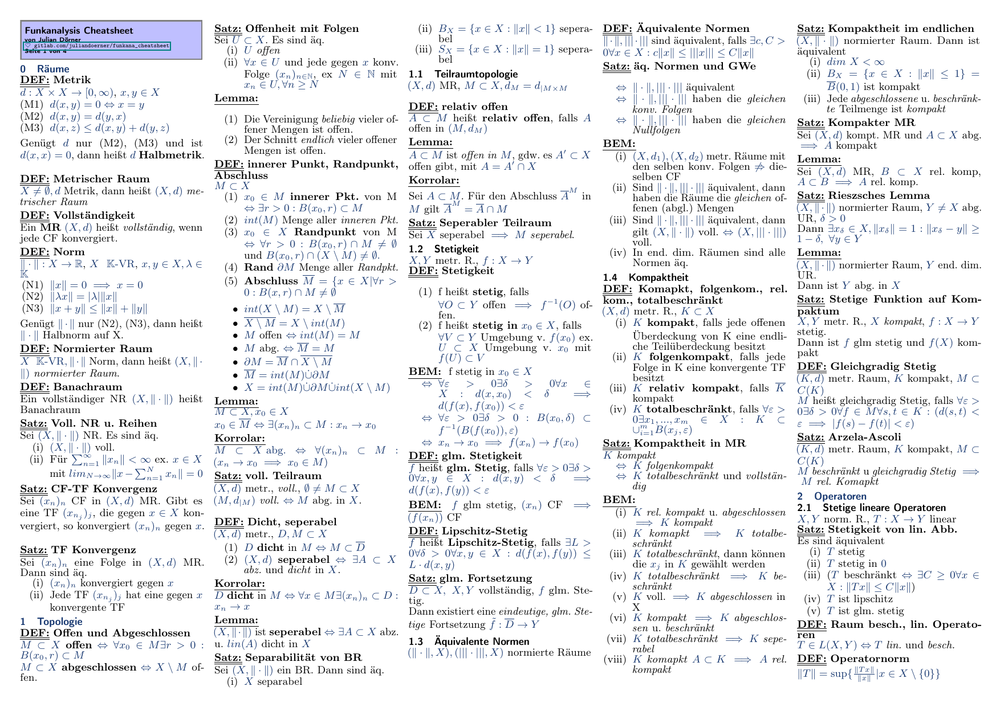

# funkana_cheatsheet

Hier findet ihr einen Cheatsheet zur Funktionalanalysis Vorlesung am KIT.
Die Vorlesung wurde im Wintersemester 19/20 von Frau Prof. Frey gelesen.

Der Cheatsheet beinhaltet alle
1. Sätze
2. Bemerkungen
3. Korrolare
4. Lemmatas
5. (Übungsaufgaben)

aus der Vorlesung.

Übungsaufgabe, die ich generell nützlich fand, habe ich ebenfalls hinzugefügt.

Hier eine Beispielseite:

